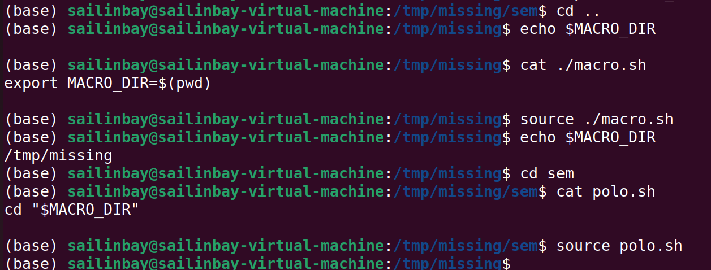
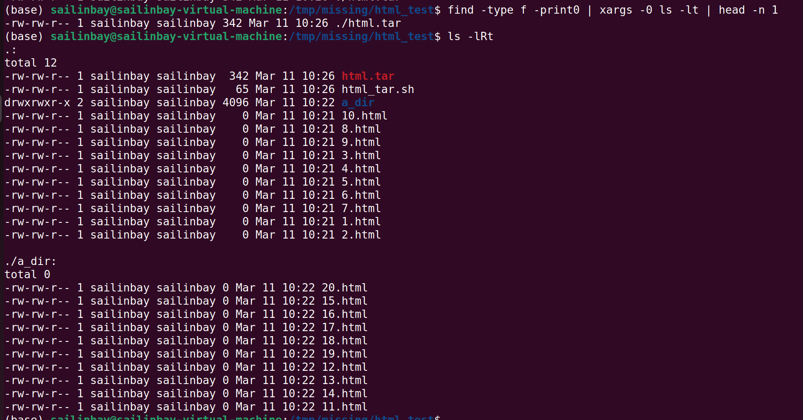

# Shell Tools and Scripting

1. Read man ls and write an ls command that lists files in the following manner

   - Includes all files, including hidden files
   - Sizes are listed in human readable format (e.g. 454M instead of 454279954)
   - Files are ordered by recency
   - Output is colorized
   A sample output would look like this

   ```shell
   -rw-r--r--   1 user group 1.1M Jan 14 09:53 baz
   drwxr-xr-x   5 user group  160 Jan 14 09:53 .
   -rw-r--r--   1 user group  514 Jan 14 06:42 bar
   -rw-r--r--   1 user group 106M Jan 13 12:12 foo
   drwx------+ 47 user group 1.5K Jan 12 18:08 ..
   ```

   

2. Write bash functions marco and polo that do the following. Whenever you execute marco the current working directory should be saved in some manner, then when you execute polo, no matter what directory you are in, polo should cd you back to the directory where you executed marco. For ease of debugging you can write the code in a file marco.sh and (re)load the definitions to your shell by executing source marco.sh.

   

3. Say you have a command that fails rarely. In order to debug it you need to capture its output but it can be time consuming to get a failure run. Write a bash script that runs the following script until it fails and captures its standard output and error streams to files and prints everything at the end. Bonus points if you can also report how many runs it took for the script to fail.

   ```bash
   #!/usr/bin/env bash

   n=$(( RANDOM % 100 ))

   if [[ n -eq 42 ]]; then
      echo "Something went wrong"
      >&2 echo "The error was using magic numbers"
      exit 1
   fi

   echo "Everything went according to plan"
   ```

   

   ```bash
   #!/usr/bin/env bash

   count=0
   rm output.log

   while true; do
      ./$1 &>> output.log
      if [[ $? -ne 0 ]]; then
         cat output.log
         echo "task $1 failed after $count successful run"
         break
      fi
      ((count++))
   done
   ```

4. As we covered in the lecture find's -exec can be very powerful for performing operations over the files we are searching for. However, what if we want to do something with all the files, like creating a zip file? As you have seen so far commands will take input from both arguments and STDIN. When piping commands, we are connecting STDOUT to STDIN, but some commands like tar take inputs from arguments. To bridge this disconnect there's the xargs command which will execute a command using STDIN as arguments. For example ls | xargs rm will delete the files in the current directory.

   Your task is to write a command that recursively finds all HTML files in the folder and makes a zip with them. Note that your command should work even if the files have spaces (hint: check -d flag for xargs).

   If you're on macOS, note that the default BSD find is different from the one included in GNU coreutils. You can use -print0 on find and the -0 flag on xargs. As a macOS user, you should be aware that command-line utilities shipped with macOS may differ from the GNU counterparts; you can install the GNU versions if you like by using brew.

   

5. (Advanced) Write a command or script to recursively find the most recently modified file in a directory. More generally, can you list all files by recency?

   ```shell
   find -type f -print0 | xargs -0 ls -lt | head -n 1
   ```

   
